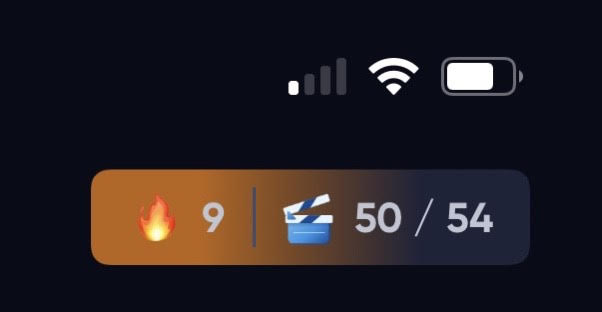
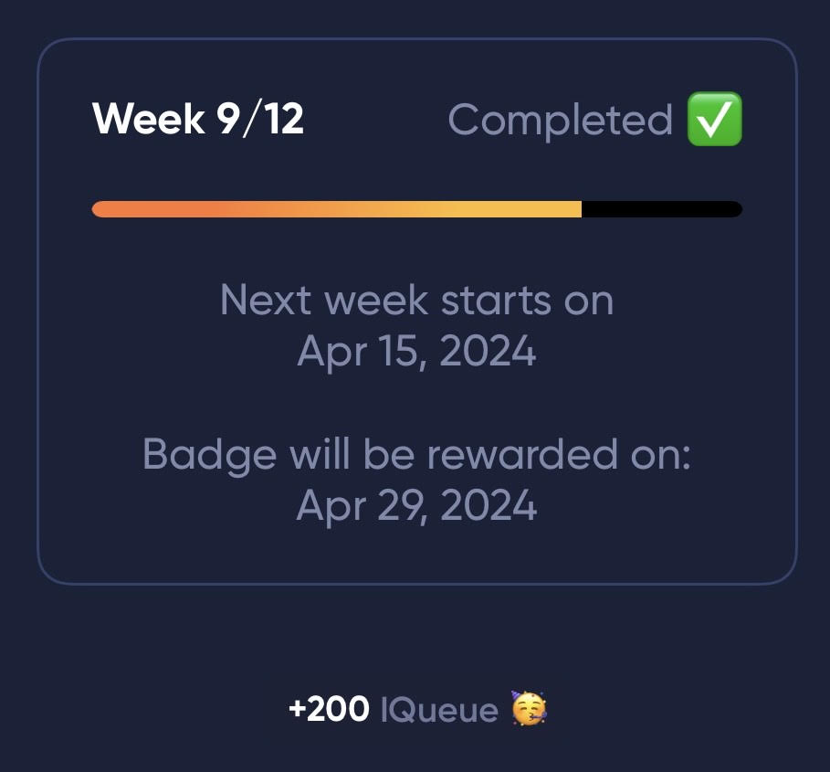
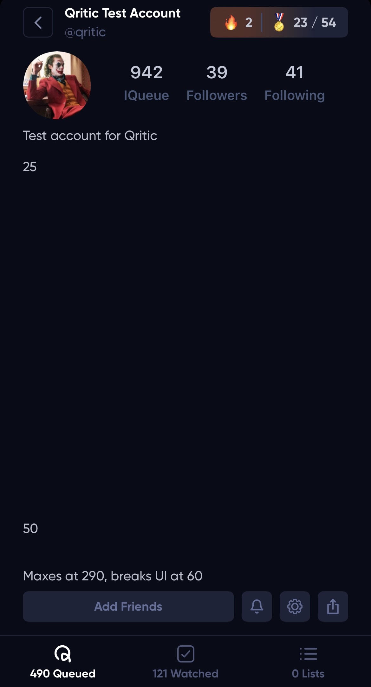
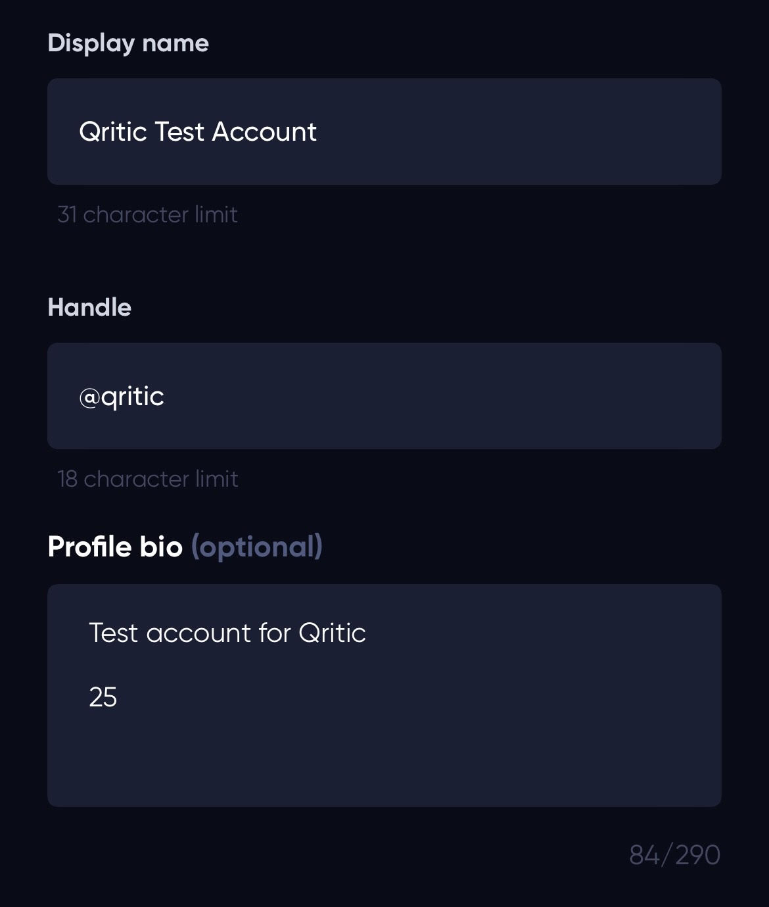
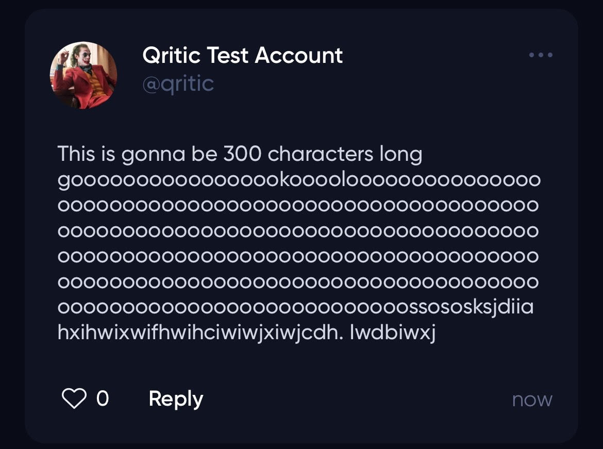
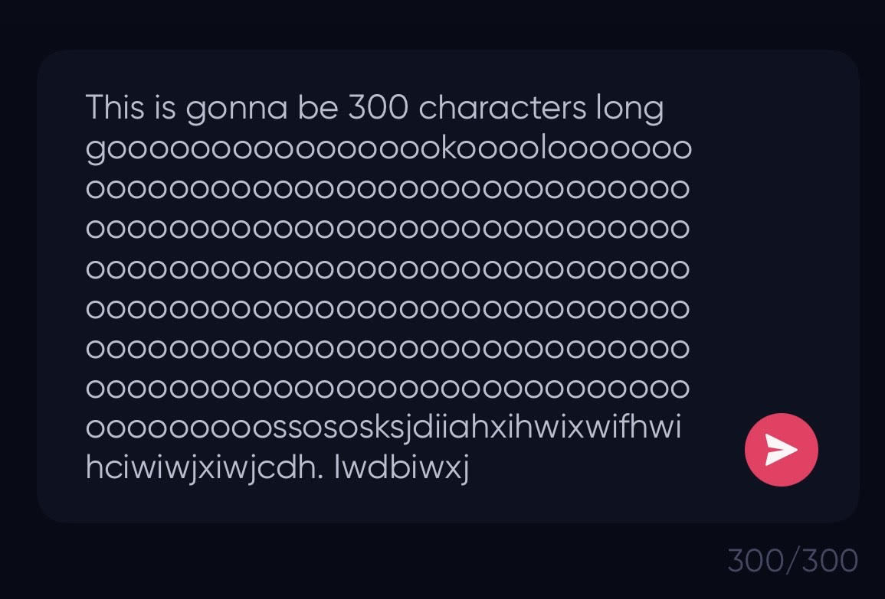
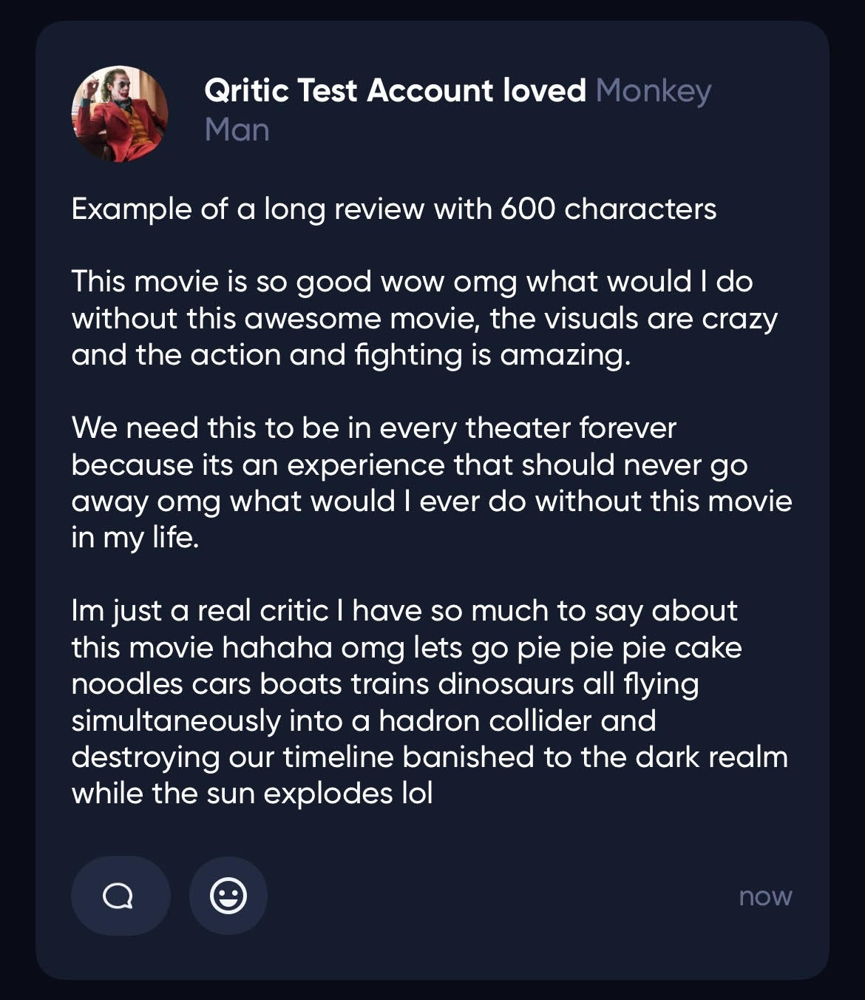
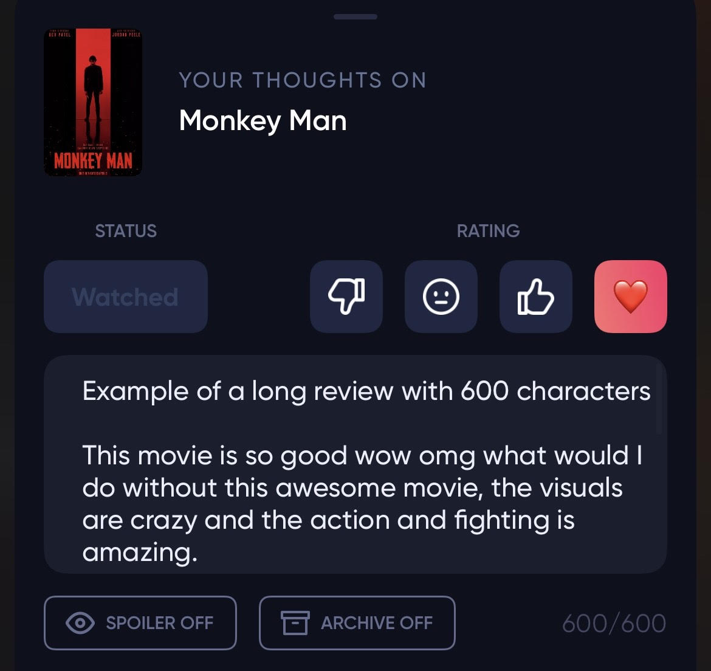

# Qritic

Qritic is an iOS tweak designed specifically for arm64e rootless devices, it enhances the functionality and (my personal) user experience of the Queue movie app by adding various QoL/modifications throughout the application.

There are no settings to enable/disable a main feature due to the fact this is for my own personal use, but thats the wonder of open source.

## Getting Started

### Dependencies

* Jailbroken arm64e IOS device, which would most likely be rootless
* Queue movie application from the appstore

### Installing

* You can get the .deb file of the most recent version directly from [here](https://github.com/ClarenceBain/Qritic/releases)
* Once downloaded on your IOS device you can use Filza to open it through your package manager (Sileo, etc.) of choice and install the tweak

## Features

### Badge Count

* Badge count now shows an "out of" amount

### Better Badge Information

* When viewing the streak challenge badges at the top it now supplies accuarate information of when each week starts and when the badge will be rewarded

### Friends/Followers

* Now when scrolling through your following/mutuals/discovery of users, anyone you follow but does not follow you back will appear with a red Following button

### No More Soft-Character Restrictions

* Although the applications server end still has limits, I've removed the soft limit imposed on the client end

#### Bio
* Limit now increased to 290 characters

#### Comments
* Limit now increased to 300 characters

#### Reviews
* Limit now increased to 600 characters

### Advanced Commands
* I've also added advanced commands that can allow the user to do multiple things
* Current commands:
  * ~auto
    * Enables auto follow/unfollow mode
  * ~auto -s
    * Enables auto "smart" follow/unfollow mode which ignores verified users and potential junk accounts
  * ~iqbot
    * Enables IQueue Point bot
	* Requires an alt account and auto reacts to a given review
	* Pretty slow, only does +1 but throw a movie on and earn IQueue through watch time
  * ~kill
    * No real use for anyone but me, but it kills the application
   
* These commands are to be executed through any of the search bars located within the application, just type the command and press return on the keyboard

## Bugs & Issues

* Its possible to break your account page adding 60+ keyboard returns in your bio, I don't see any logical way this would happen without you purposely doing this
  * You will only be able to fix it using some form of Flex
* Comment character count may say /150 still but I can assure you that it maxes at 300 characters
* You can potentially get banned if you purposely try and disrupt comments/reviews by spamming keyboard returns to make a huge block review/comment
* When using the advanced commands, like auto follow/unfollow, its likely your account will get rate limited if you go incredibly fast
  * The length of time your account is limited depends on how fast you were going
  * You'll notice error messages which can be ignored at first, but eventually you'll be rate limited

## License

This project is licensed under the MIT License - see the [LICENSE.md](LICENSE) file for details